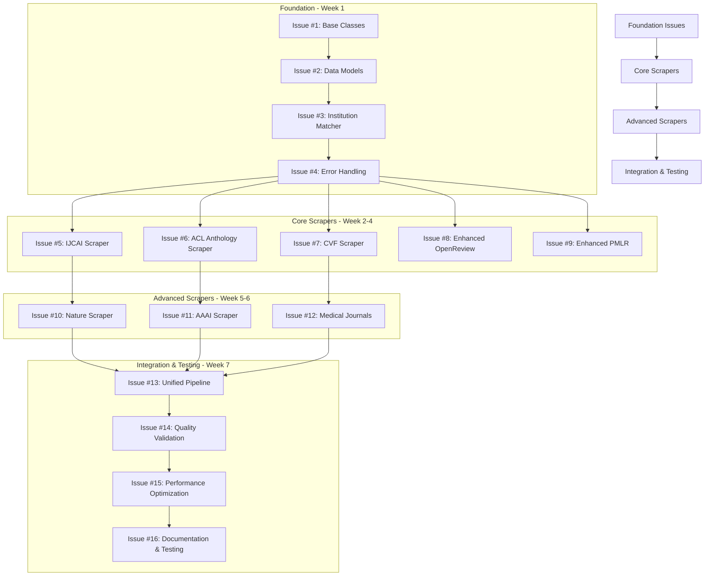

# Comprehensive Scraper Implementation Milestone

**Date**: 2025-01-06  
**Project**: Comprehensive Paper Collection Scrapers  
**Timeline**: 7 weeks (35 working days)

## Implementation Flow Diagram



## Single Milestone: Complete Scraper Infrastructure (7 weeks)

**Objective**: Implement comprehensive paper collection scrapers for 95%+ venue coverage complementing paperoni

### Issue #1: Base Scraper Classes Framework
**Priority**: Critical  
**Estimate**: L (6-8 hours)  
**Dependencies**: None

#### Description
Create foundational base classes that all scrapers will inherit from, ensuring consistency and reducing code duplication.

#### Detailed Implementation
```python
# compute_forecast/data/sources/scrapers/base.py

from abc import ABC, abstractmethod
from typing import List, Dict, Optional, Any
from dataclasses import dataclass
from datetime import datetime
import logging

@dataclass
class ScrapingConfig:
    """Configuration for scraper behavior"""
    rate_limit_delay: float = 1.0
    max_retries: int = 3
    timeout: int = 30
    batch_size: int = 100
    cache_enabled: bool = True
    
@dataclass
class ScrapingResult:
    """Result of a scraping operation"""
    success: bool
    papers_collected: int
    errors: List[str]
    metadata: Dict[str, Any]
    timestamp: datetime

class BaseScaper(ABC):
    """Abstract base class for all paper scrapers"""
    
    def __init__(self, source_name: str, config: ScrapingConfig):
        self.source_name = source_name
        self.config = config
        self.logger = logging.getLogger(f"scraper.{source_name}")
        self._session = None
        self._cache = {}
        
    @abstractmethod
    def get_supported_venues(self) -> List[str]:
        """Return list of venue names this scraper supports"""
        pass
        
    @abstractmethod
    def get_available_years(self, venue: str) -> List[int]:
        """Return available years for a specific venue"""
        pass
        
    @abstractmethod
    def scrape_venue_year(self, venue: str, year: int) -> ScrapingResult:
        """Scrape all papers from a venue for a specific year"""
        pass
        
    def scrape_multiple_venues(self, venue_years: Dict[str, List[int]]) -> Dict[str, ScrapingResult]:
        """Scrape papers from multiple venues/years"""
        results = {}
        for venue, years in venue_years.items():
            if venue not in self.get_supported_venues():
                self.logger.warning(f"Venue {venue} not supported by {self.source_name}")
                continue
                
            for year in years:
                key = f"{venue}_{year}"
                results[key] = self.scrape_venue_year(venue, year)
                time.sleep(self.config.rate_limit_delay)
                
        return results

class ConferenceProceedingsScaper(BaseScaper):
    """Base class for conference proceedings scrapers"""
    
    @abstractmethod
    def get_proceedings_url(self, venue: str, year: int) -> str:
        """Construct proceedings URL for venue/year"""
        pass
        
    @abstractmethod
    def parse_proceedings_page(self, html: str, venue: str, year: int) -> List[Paper]:
        """Parse proceedings page HTML to extract papers"""
        pass

class JournalPublisherScaper(BaseScaper):
    """Base class for journal publisher scrapers"""
    
    @abstractmethod
    def search_papers(self, journal: str, keywords: List[str], year_range: Tuple[int, int]) -> List[Paper]:
        """Search for papers in journal by keywords and year range"""
        pass

class APIEnhancedScaper(BaseScaper):
    """Base class for API-based scrapers"""
    
    @abstractmethod
    def authenticate(self) -> bool:
        """Authenticate with API if required"""
        pass
        
    @abstractmethod
    def make_api_request(self, endpoint: str, params: Dict) -> Dict:
        """Make authenticated API request"""
        pass
```

#### Acceptance Criteria
- [ ] Base classes provide consistent interface for all scraper types
- [ ] Comprehensive error handling and logging
- [ ] Rate limiting and timeout management
- [ ] Configuration system for scraper behavior
- [ ] Session management for HTTP requests
- [ ] Cache infrastructure for repeated requests

---

### Issue #2: Enhanced Data Models for Scraped Papers
**Priority**: Critical  
**Estimate**: M (4-6 hours)  
**Dependencies**: Issue #1

#### Description
Extend existing Paper models to handle scraped data, ensuring compatibility with paperoni and package data structures.

#### Detailed Implementation
```python
# compute_forecast/data/sources/scrapers/models.py

from compute_forecast.data.models import Paper, Author
from typing import List, Optional, Dict, Any
from dataclasses import dataclass, field
from datetime import datetime

@dataclass
class ScrapedPaper(Paper):
    """Extended Paper model for scraped data"""
    
    # Source tracking
    source_scraper: str = ""
    source_url: str = ""
    scraped_at: datetime = field(default_factory=datetime.now)
    
    # Enhanced metadata
    pdf_urls: List[str] = field(default_factory=list)
    abstract_html: Optional[str] = None
    keywords: List[str] = field(default_factory=list)
    
    # Conference-specific data
    session: Optional[str] = None
    track: Optional[str] = None
    presentation_type: Optional[str] = None  # oral, poster, demo
    
    # Quality indicators
    metadata_completeness: float = 0.0
    extraction_confidence: float = 0.0
    
    def to_paper(self) -> Paper:
        """Convert to standard Paper object for compatibility"""
        return Paper(
            paper_id=self.paper_id,
            title=self.title,
            authors=self.authors,
            venue=self.venue,
            year=self.year,
            citations=self.citations,
            abstract=self.abstract,
            doi=self.doi,
            urls=self.urls + self.pdf_urls,
            collection_source=self.source_scraper,
            collection_timestamp=self.scraped_at
        )

@dataclass
class ScrapedAuthor(Author):
    """Extended Author model for scraped data"""
    
    # Enhanced affiliation data
    affiliation_raw: Optional[str] = None
    department: Optional[str] = None
    country: Optional[str] = None
    
    # Author position in paper
    position: Optional[int] = None
    is_corresponding: bool = False
    
    def to_author(self) -> Author:
        """Convert to standard Author object"""
        return Author(
            name=self.name,
            author_id=self.author_id,
            affiliation=self.affiliation or self.affiliation_raw
        )

@dataclass
class VenueMetadata:
    """Metadata about a venue/conference"""
    venue_name: str
    full_name: str
    venue_type: str  # conference, journal, workshop
    publisher: Optional[str] = None
    issn: Optional[str] = None
    url_pattern: Optional[str] = None
    scraping_notes: Optional[str] = None
```

#### Acceptance Criteria
- [ ] ScrapedPaper extends Paper with scraper-specific fields
- [ ] Conversion methods for compatibility with existing systems
- [ ] Enhanced author affiliation tracking
- [ ] Venue metadata management
- [ ] Data validation and quality scoring

---

### Issue #3: Institution Filtering Wrapper
**Priority**: Low  
**Estimate**: S (2-3 hours)  
**Dependencies**: Issue #2

#### Description
Create thin wrapper around existing institution processing infrastructure (EnhancedOrganizationClassifier with 225+ institutions, fuzzy matching, and alias support) to provide unified filtering interface for scraped papers.

#### Detailed Implementation
```python
# compute_forecast/data/sources/scrapers/institution_filter.py

from typing import List, Dict, Optional
from compute_forecast.analysis.classification.enhanced_organizations import EnhancedOrganizationClassifier
from compute_forecast.analysis.classification.enhanced_affiliation_parser import EnhancedAffiliationParser
from ..models import ScrapedPaper

class InstitutionFilterWrapper:
    """Wrapper coordinating existing institution processing for scraped papers"""
    
    def __init__(self):
        # Use existing comprehensive infrastructure
        self.classifier = EnhancedOrganizationClassifier()  # 225+ institutions, fuzzy matching
        self.parser = EnhancedAffiliationParser()  # Complex affiliation parsing
        
    def filter_papers_by_institutions(self, papers: List[ScrapedPaper], target_institutions: List[str]) -> List[ScrapedPaper]:
        """Filter papers using existing classification infrastructure
        
        Args:
            papers: List of scraped papers
            target_institutions: List of canonical institution names to filter by
            
        Returns:
            Papers affiliated with target institutions
        """
        filtered_papers = []
        
        for paper in papers:
            # Check each author's affiliation using existing classifier
            for author in paper.authors:
                if not author.affiliation and not getattr(author, 'affiliation_raw', None):
                    continue
                    
                affiliation = getattr(author, 'affiliation_raw', author.affiliation)
                
                # Use existing enhanced classifier with all its features
                classification = self.classifier.classify_with_confidence(affiliation)
                
                # Check if matches target institution with high confidence
                if (classification and 
                    classification.get('name') in target_institutions and 
                    classification.get('confidence', 0) >= 0.8):
                    
                    # Store confidence on paper for tracking
                    paper.extraction_confidence = classification['confidence']
                    filtered_papers.append(paper)
                    break  # One matching author is enough
                    
        return filtered_papers
    
    def get_mila_papers(self, papers: List[ScrapedPaper]) -> List[ScrapedPaper]:
        """Convenience method for Mila filtering using existing configurations"""
        # Mila is already configured in the classifier with all aliases
        return self.filter_papers_by_institutions(papers, ["Mila - Quebec AI Institute"])
        
    def get_benchmark_institution_papers(self, papers: List[ScrapedPaper]) -> Dict[str, List[ScrapedPaper]]:
        """Get papers grouped by benchmark institutions"""
        # These institutions are already in the 225+ configured organizations
        benchmark_institutions = {
            "MIT": "Massachusetts Institute of Technology",
            "Stanford": "Stanford University",
            "CMU": "Carnegie Mellon University",
            "DeepMind": "DeepMind",
            "OpenAI": "OpenAI"
        }
        
        results = {}
        for short_name, full_name in benchmark_institutions.items():
            results[short_name] = self.filter_papers_by_institutions(papers, [full_name])
            
        return results
    
    def get_institution_statistics(self, papers: List[ScrapedPaper]) -> Dict[str, int]:
        """Get statistics on institutions found in paper collection"""
        institution_counts = {}
        
        for paper in papers:
            for author in paper.authors:
                if not author.affiliation:
                    continue
                    
                classification = self.classifier.classify_with_confidence(author.affiliation)
                if classification and classification.get('confidence', 0) >= 0.8:
                    inst_name = classification.get('name', 'Unknown')
                    institution_counts[inst_name] = institution_counts.get(inst_name, 0) + 1
                    
        return institution_counts
```

#### Acceptance Criteria
- [ ] Leverages existing EnhancedOrganizationClassifier (225+ institutions)
- [ ] Uses existing fuzzy matching and alias support
- [ ] Simple wrapper interface for scraper pipeline
- [ ] Convenience methods for common use cases
- [ ] No duplication of existing functionality
- [ ] Institution statistics reporting

---

### Issue #4: Robust Error Handling & Monitoring
**Priority**: High  
**Estimate**: M (4-6 hours)  
**Dependencies**: Issue #1

#### Description
Implement comprehensive error handling, retry logic, and monitoring for all scrapers to ensure reliable long-running collection jobs.

#### Detailed Implementation
```python
# compute_forecast/data/sources/scrapers/error_handling.py

import time
import logging
from typing import Optional, Callable, Any, Dict
from functools import wraps
from enum import Enum
import traceback

class ErrorType(Enum):
    NETWORK_ERROR = "network_error"
    PARSING_ERROR = "parsing_error"
    RATE_LIMIT_ERROR = "rate_limit_error"
    AUTHENTICATION_ERROR = "auth_error"
    DATA_VALIDATION_ERROR = "validation_error"

@dataclass
class ScrapingError:
    """Detailed error information"""
    error_type: ErrorType
    message: str
    url: Optional[str] = None
    venue: Optional[str] = None
    year: Optional[int] = None
    timestamp: datetime = field(default_factory=datetime.now)
    traceback: Optional[str] = None
    retry_count: int = 0

class ScrapingMonitor:
    """Monitor scraping operations and track errors"""
    
    def __init__(self):
        self.errors: List[ScrapingError] = []
        self.stats = {
            "papers_collected": 0,
            "venues_processed": 0,
            "errors_total": 0,
            "start_time": None,
            "end_time": None
        }
        
    def record_error(self, error: ScrapingError):
        """Record an error that occurred during scraping"""
        self.errors.append(error)
        self.stats["errors_total"] += 1
        
        # Log error
        logger = logging.getLogger("scraper.monitor")
        logger.error(f"Scraping error: {error.error_type.value} - {error.message}")
        
    def record_success(self, papers_count: int, venue: str, year: int):
        """Record successful scraping operation"""
        self.stats["papers_collected"] += papers_count
        self.stats["venues_processed"] += 1
        
        logger = logging.getLogger("scraper.monitor")
        logger.info(f"Successfully scraped {papers_count} papers from {venue} {year}")
        
    def get_error_summary(self) -> Dict[str, int]:
        """Get summary of errors by type"""
        summary = {}
        for error in self.errors:
            error_type = error.error_type.value
            summary[error_type] = summary.get(error_type, 0) + 1
        return summary
        
    def get_performance_report(self) -> Dict[str, Any]:
        """Generate performance report"""
        duration = None
        if self.stats["start_time"] and self.stats["end_time"]:
            duration = (self.stats["end_time"] - self.stats["start_time"]).total_seconds()
            
        return {
            "papers_collected": self.stats["papers_collected"],
            "venues_processed": self.stats["venues_processed"],
            "total_errors": self.stats["errors_total"],
            "error_rate": self.stats["errors_total"] / max(1, self.stats["venues_processed"]),
            "duration_seconds": duration,
            "papers_per_second": self.stats["papers_collected"] / max(1, duration or 1),
            "error_summary": self.get_error_summary()
        }

def retry_on_error(max_retries: int = 3, delay: float = 1.0, backoff: float = 2.0):
    """Decorator for retrying functions on specific errors"""
    
    def decorator(func: Callable) -> Callable:
        @wraps(func)
        def wrapper(*args, **kwargs) -> Any:
            retries = 0
            current_delay = delay
            
            while retries <= max_retries:
                try:
                    return func(*args, **kwargs)
                    
                except requests.exceptions.RequestException as e:
                    retries += 1
                    if retries > max_retries:
                        raise ScrapingError(
                            error_type=ErrorType.NETWORK_ERROR,
                            message=f"Network error after {max_retries} retries: {str(e)}",
                            traceback=traceback.format_exc()
                        )
                    
                    time.sleep(current_delay)
                    current_delay *= backoff
                    
                except Exception as e:
                    # Don't retry on non-network errors
                    raise ScrapingError(
                        error_type=ErrorType.PARSING_ERROR,
                        message=f"Unexpected error: {str(e)}",
                        traceback=traceback.format_exc()
                    )
                    
        return wrapper
    return decorator

class RateLimiter:
    """Intelligent rate limiting with backoff"""
    
    def __init__(self, requests_per_second: float = 1.0):
        self.min_interval = 1.0 / requests_per_second
        self.last_request_time = 0.0
        self.consecutive_errors = 0
        
    def wait(self):
        """Wait appropriate amount based on rate limit and recent errors"""
        current_time = time.time()
        time_since_last = current_time - self.last_request_time
        
        # Base delay
        required_delay = self.min_interval
        
        # Exponential backoff for consecutive errors
        if self.consecutive_errors > 0:
            required_delay *= (2 ** min(self.consecutive_errors, 5))
            
        if time_since_last < required_delay:
            sleep_time = required_delay - time_since_last
            time.sleep(sleep_time)
            
        self.last_request_time = time.time()
        
    def record_success(self):
        """Record successful request"""
        self.consecutive_errors = 0
        
    def record_error(self):
        """Record failed request"""
        self.consecutive_errors += 1
```

#### Acceptance Criteria
- [ ] Comprehensive error categorization and tracking
- [ ] Retry logic with exponential backoff
- [ ] Rate limiting with adaptive delays
- [ ] Performance monitoring and reporting
- [ ] Graceful error recovery without stopping entire collection
- [ ] Detailed logging for debugging

---

### Issue #5: IJCAI Conference Scraper
**Priority**: High  
**Estimate**: M (4-6 hours)  
**Dependencies**: Issues #1, #2, #4

#### Description
Implement IJCAI proceedings scraper - highest success rate target with 1,048+ papers immediately available.

#### Detailed Implementation
```python
# compute_forecast/data/sources/scrapers/conference_scrapers/ijcai_scraper.py

import re
import requests
from bs4 import BeautifulSoup
from typing import List, Dict, Optional
from urllib.parse import urljoin

from ..base import ConferenceProceedingsScaper, ScrapingConfig, ScrapingResult
from ..models import ScrapedPaper, ScrapedAuthor
from ..error_handling import retry_on_error, ErrorType, ScrapingError

class IJCAIScraper(ConferenceProceedingsScaper):
    """Scraper for IJCAI conference proceedings"""
    
    def __init__(self, config: ScrapingConfig = None):
        super().__init__("ijcai", config or ScrapingConfig())
        self.base_url = "https://www.ijcai.org/"
        self.proceedings_pattern = "proceedings/{year}/"
        
    def get_supported_venues(self) -> List[str]:
        return ["IJCAI"]
        
    def get_available_years(self, venue: str) -> List[int]:
        """Get available IJCAI years by checking proceedings index"""
        if venue != "IJCAI":
            return []
            
        try:
            url = urljoin(self.base_url, "proceedings/")
            response = requests.get(url, timeout=self.config.timeout)
            response.raise_for_status()
            
            soup = BeautifulSoup(response.content, 'html.parser')
            years = []
            
            # Look for year links in proceedings index
            for link in soup.find_all('a', href=True):
                href = link['href']
                year_match = re.search(r'proceedings/(\d{4})', href)
                if year_match:
                    years.append(int(year_match.group(1)))
                    
            return sorted(list(set(years)), reverse=True)
            
        except Exception as e:
            self.logger.error(f"Failed to get IJCAI years: {e}")
            # Fallback to known years
            return list(range(2024, 2018, -1))
    
    def get_proceedings_url(self, venue: str, year: int) -> str:
        """Construct IJCAI proceedings URL"""
        return urljoin(self.base_url, self.proceedings_pattern.format(year=year))
        
    @retry_on_error(max_retries=3, delay=1.0)
    def scrape_venue_year(self, venue: str, year: int) -> ScrapingResult:
        """Scrape IJCAI papers for a specific year"""
        if venue != "IJCAI":
            return ScrapingResult(
                success=False, 
                papers_collected=0, 
                errors=[f"Venue {venue} not supported"],
                metadata={}, 
                timestamp=datetime.now()
            )
            
        try:
            url = self.get_proceedings_url(venue, year)
            papers = self.parse_proceedings_page_from_url(url, venue, year)
            
            return ScrapingResult(
                success=True,
                papers_collected=len(papers),
                errors=[],
                metadata={"url": url, "venue": venue, "year": year},
                timestamp=datetime.now()
            )
            
        except Exception as e:
            error_msg = f"Failed to scrape {venue} {year}: {str(e)}"
            self.logger.error(error_msg)
            return ScrapingResult(
                success=False,
                papers_collected=0,
                errors=[error_msg],
                metadata={"venue": venue, "year": year},
                timestamp=datetime.now()
            )
    
    def parse_proceedings_page_from_url(self, url: str, venue: str, year: int) -> List[ScrapedPaper]:
        """Fetch and parse proceedings page"""
        response = requests.get(url, timeout=self.config.timeout)
        response.raise_for_status()
        return self.parse_proceedings_page(response.text, venue, year)
        
    def parse_proceedings_page(self, html: str, venue: str, year: int) -> List[ScrapedPaper]:
        """Parse IJCAI proceedings HTML to extract papers"""
        soup = BeautifulSoup(html, 'html.parser')
        papers = []
        
        # IJCAI pattern: PDF links with adjacent title/author info
        pdf_links = soup.find_all('a', href=lambda x: x and '.pdf' in x)
        
        for pdf_link in pdf_links:
            try:
                paper = self._extract_paper_from_pdf_link(pdf_link, venue, year)
                if paper:
                    papers.append(paper)
            except Exception as e:
                self.logger.warning(f"Failed to extract paper from link {pdf_link}: {e}")
                continue
                
        self.logger.info(f"Extracted {len(papers)} papers from {venue} {year}")
        return papers
        
    def _extract_paper_from_pdf_link(self, pdf_link, venue: str, year: int) -> Optional[ScrapedPaper]:
        """Extract paper metadata from PDF link and surrounding elements"""
        pdf_url = pdf_link.get('href', '')
        if not pdf_url:
            return None
            
        # Make URL absolute
        if not pdf_url.startswith('http'):
            pdf_url = urljoin(self.base_url, pdf_url)
            
        # Extract paper ID from PDF filename
        pdf_filename = pdf_url.split('/')[-1]
        paper_id = re.sub(r'\.pdf$', '', pdf_filename)
        
        # Get title - usually the link text or nearby text
        title = pdf_link.get_text(strip=True)
        if not title or len(title) < 10:
            # Look for title in parent elements
            parent = pdf_link.parent
            if parent:
                title_candidates = parent.find_all(text=True)
                title = ' '.join([t.strip() for t in title_candidates if len(t.strip()) > 10])[:200]
                
        # Extract authors - look for patterns near the PDF link
        authors = self._extract_authors_near_element(pdf_link)
        
        # Generate paper ID
        full_paper_id = f"ijcai_{year}_{paper_id}"
        
        return ScrapedPaper(
            paper_id=full_paper_id,
            title=title.strip(),
            authors=authors,
            venue=venue,
            year=year,
            pdf_urls=[pdf_url],
            source_scraper="ijcai",
            source_url=pdf_url,
            metadata_completeness=self._calculate_completeness(title, authors),
            extraction_confidence=0.9  # High confidence for direct PDF links
        )
        
    def _extract_authors_near_element(self, element) -> List[ScrapedAuthor]:
        """Extract author information from elements near the PDF link"""
        authors = []
        
        # Look in parent and sibling elements for author patterns
        search_elements = [element.parent] if element.parent else []
        if element.parent and element.parent.parent:
            search_elements.extend(element.parent.parent.find_all(text=True))
            
        author_pattern = re.compile(r'([A-Z][a-z]+ [A-Z][a-z]+(?:, [A-Z][a-z]+ [A-Z][a-z]+)*)')
        
        for elem in search_elements:
            text = str(elem) if hasattr(elem, 'get_text') else str(elem)
            matches = author_pattern.findall(text)
            
            for match in matches:
                # Split multiple authors
                author_names = [name.strip() for name in match.split(',')]
                for i, name in enumerate(author_names):
                    if len(name.split()) >= 2:  # At least first and last name
                        authors.append(ScrapedAuthor(
                            name=name,
                            position=len(authors) + 1
                        ))
                        
        return authors[:10]  # Limit to reasonable number
        
    def _calculate_completeness(self, title: str, authors: List[ScrapedAuthor]) -> float:
        """Calculate metadata completeness score"""
        score = 0.0
        
        if title and len(title) > 10:
            score += 0.4
        if authors:
            score += 0.4
        if len(authors) > 1:
            score += 0.2
            
        return min(1.0, score)
```

#### API Specification
```python
# Public API for IJCAI scraper
scraper = IJCAIScraper()

# Get available years
years = scraper.get_available_years("IJCAI")  # Returns [2024, 2023, 2022, ...]

# Scrape specific year
result = scraper.scrape_venue_year("IJCAI", 2024)
# Returns ScrapingResult with papers_collected, errors, metadata

# Scrape multiple years
venue_years = {"IJCAI": [2024, 2023, 2022]}
results = scraper.scrape_multiple_venues(venue_years)
# Returns Dict[str, ScrapingResult] keyed by "venue_year"
```

#### Acceptance Criteria
- [ ] Successfully extracts 1,000+ papers from IJCAI 2024
- [ ] Parses paper titles, authors, and PDF URLs accurately
- [ ] Handles missing data gracefully
- [ ] Provides confidence scores for extracted data
- [ ] Supports multiple years (2018-2024)
- [ ] Rate limiting and error recovery

---

### Issue #6: ACL Anthology Scraper
**Priority**: High  
**Estimate**: L (6-8 hours)  
**Dependencies**: Issues #1, #2, #4

#### Description
Implement ACL Anthology scraper for comprehensive NLP conference coverage (ACL, EMNLP, NAACL, COLING) with 465 venues available.

#### Detailed Implementation
```python
# compute_forecast/data/sources/scrapers/conference_scrapers/acl_anthology_scraper.py

import re
import requests
from bs4 import BeautifulSoup
from typing import List, Dict, Optional, Set
from urllib.parse import urljoin

from ..base import ConferenceProceedingsScaper, ScrapingConfig, ScrapingResult
from ..models import ScrapedPaper, ScrapedAuthor
from ..error_handling import retry_on_error

class ACLAnthologyScraper(ConferenceProceedingsScaper):
    """Scraper for ACL Anthology proceedings"""
    
    def __init__(self, config: ScrapingConfig = None):
        super().__init__("acl_anthology", config or ScrapingConfig())
        self.base_url = "https://aclanthology.org/"
        self.venue_mappings = self._load_venue_mappings()
        
    def _load_venue_mappings(self) -> Dict[str, str]:
        """Map common venue names to ACL Anthology codes"""
        return {
            "ACL": "acl",
            "EMNLP": "emnlp", 
            "NAACL": "naacl",
            "COLING": "coling",
            "EACL": "eacl",
            "CoNLL": "conll",
            "SemEval": "semeval",
            "WMT": "wmt"
        }
        
    def get_supported_venues(self) -> List[str]:
        return list(self.venue_mappings.keys())
        
    def get_available_years(self, venue: str) -> List[int]:
        """Get years available for a venue from ACL Anthology"""
        if venue not in self.venue_mappings:
            return []
            
        venue_code = self.venue_mappings[venue]
        venue_url = urljoin(self.base_url, f"venues/{venue_code}/")
        
        try:
            response = requests.get(venue_url, timeout=self.config.timeout)
            response.raise_for_status()
            
            soup = BeautifulSoup(response.content, 'html.parser')
            years = set()
            
            # Look for year-based volume links
            for link in soup.find_all('a', href=True):
                href = link['href']
                # Pattern: /volumes/2024.acl-main/, /events/acl-2024/
                year_match = re.search(r'(?:volumes/|events/.*-)(\d{4})', href)
                if year_match:
                    years.add(int(year_match.group(1)))
                    
            return sorted(list(years), reverse=True)
            
        except Exception as e:
            self.logger.error(f"Failed to get {venue} years: {e}")
            # Fallback to recent years
            return list(range(2024, 2018, -1))
    
    def get_proceedings_url(self, venue: str, year: int) -> str:
        """Construct ACL Anthology volume URL"""
        venue_code = self.venue_mappings.get(venue, venue.lower())
        return urljoin(self.base_url, f"volumes/{year}.{venue_code}-main/")
        
    @retry_on_error(max_retries=3, delay=1.0)
    def scrape_venue_year(self, venue: str, year: int) -> ScrapingResult:
        """Scrape ACL Anthology papers for venue/year"""
        if venue not in self.venue_mappings:
            return ScrapingResult(
                success=False,
                papers_collected=0,
                errors=[f"Venue {venue} not supported"],
                metadata={},
                timestamp=datetime.now()
            )
            
        try:
            # Try main volume first
            main_url = self.get_proceedings_url(venue, year)
            papers = []
            
            try:
                papers.extend(self.parse_proceedings_page_from_url(main_url, venue, year))
            except requests.exceptions.RequestException:
                self.logger.warning(f"Main volume not found: {main_url}")
                
            # Try additional volumes (short papers, demos, etc.)
            additional_volumes = self._get_additional_volumes(venue, year)
            for vol_url in additional_volumes:
                try:
                    papers.extend(self.parse_proceedings_page_from_url(vol_url, venue, year))
                except requests.exceptions.RequestException:
                    self.logger.warning(f"Additional volume not found: {vol_url}")
                    continue
                    
            return ScrapingResult(
                success=True,
                papers_collected=len(papers),
                errors=[],
                metadata={"venue": venue, "year": year, "volumes_checked": len(additional_volumes) + 1},
                timestamp=datetime.now()
            )
            
        except Exception as e:
            error_msg = f"Failed to scrape {venue} {year}: {str(e)}"
            self.logger.error(error_msg)
            return ScrapingResult(
                success=False,
                papers_collected=0,
                errors=[error_msg],
                metadata={"venue": venue, "year": year},
                timestamp=datetime.now()
            )
    
    def _get_additional_volumes(self, venue: str, year: int) -> List[str]:
        """Get additional volume URLs for venue/year"""
        venue_code = self.venue_mappings.get(venue, venue.lower())
        base_pattern = f"{year}.{venue_code}"
        
        additional_suffixes = [
            "short", "demo", "findings", "industry", "srw", "tutorial", "workshop"
        ]
        
        urls = []
        for suffix in additional_suffixes:
            url = urljoin(self.base_url, f"volumes/{base_pattern}-{suffix}/")
            urls.append(url)
            
        return urls
        
    def parse_proceedings_page_from_url(self, url: str, venue: str, year: int) -> List[ScrapedPaper]:
        """Fetch and parse ACL Anthology volume page"""
        response = requests.get(url, timeout=self.config.timeout)
        response.raise_for_status()
        return self.parse_proceedings_page(response.text, venue, year, url)
        
    def parse_proceedings_page(self, html: str, venue: str, year: int, source_url: str = "") -> List[ScrapedPaper]:
        """Parse ACL Anthology volume HTML"""
        soup = BeautifulSoup(html, 'html.parser')
        papers = []
        
        # ACL Anthology uses structured paper entries
        paper_entries = soup.find_all('p', class_='d-sm-flex align-items-stretch')
        
        if not paper_entries:
            # Fallback: look for any links to paper pages
            paper_entries = soup.find_all('a', href=lambda x: x and re.match(r'.*\d{4}\.[a-z]+.*\d+/', x))
            
        for entry in paper_entries:
            try:
                paper = self._extract_paper_from_entry(entry, venue, year, source_url)
                if paper:
                    papers.append(paper)
            except Exception as e:
                self.logger.warning(f"Failed to extract paper from entry: {e}")
                continue
                
        self.logger.info(f"Extracted {len(papers)} papers from {venue} {year}")
        return papers
        
    def _extract_paper_from_entry(self, entry, venue: str, year: int, source_url: str) -> Optional[ScrapedPaper]:
        """Extract paper from ACL Anthology entry"""
        
        # Get paper URL
        paper_link = entry.find('a', href=True)
        if not paper_link:
            return None
            
        paper_url = paper_link['href']
        if not paper_url.startswith('http'):
            paper_url = urljoin(self.base_url, paper_url)
            
        # Extract paper ID from URL
        paper_id_match = re.search(r'(\d{4}\.[a-z]+-[a-z]+\.\d+)', paper_url)
        paper_id = paper_id_match.group(1) if paper_id_match else paper_url.split('/')[-2]
        
        # Get title
        title = paper_link.get_text(strip=True)
        if not title:
            # Look for title in nearby elements
            title_elem = entry.find('strong') or entry.find('b')
            title = title_elem.get_text(strip=True) if title_elem else ""
            
        # Get authors
        authors = self._extract_authors_from_entry(entry)
        
        # Get PDF URL
        pdf_url = None
        pdf_link = entry.find('a', href=lambda x: x and '.pdf' in x)
        if pdf_link:
            pdf_url = pdf_link['href']
            if not pdf_url.startswith('http'):
                pdf_url = urljoin(self.base_url, pdf_url)
                
        return ScrapedPaper(
            paper_id=f"acl_{paper_id}",
            title=title,
            authors=authors,
            venue=venue,
            year=year,
            pdf_urls=[pdf_url] if pdf_url else [],
            source_scraper="acl_anthology",
            source_url=paper_url,
            metadata_completeness=self._calculate_completeness(title, authors, pdf_url),
            extraction_confidence=0.95  # High confidence for ACL Anthology
        )
        
    def _extract_authors_from_entry(self, entry) -> List[ScrapedAuthor]:
        """Extract authors from ACL Anthology entry"""
        authors = []
        
        # Look for author information in various patterns
        author_patterns = [
            entry.find('i'),  # Italic text often contains authors
            entry.find(text=re.compile(r'[A-Z][a-z]+ [A-Z][a-z]+'))  # Name patterns
        ]
        
        author_text = ""
        for pattern in author_patterns:
            if pattern:
                author_text = pattern.get_text() if hasattr(pattern, 'get_text') else str(pattern)
                break
                
        if author_text:
            # Split authors (common separators: comma, semicolon, 'and')
            author_names = re.split(r'[,;]|\sand\s', author_text)
            
            for i, name in enumerate(author_names):
                name = name.strip()
                if len(name.split()) >= 2:  # At least first and last name
                    authors.append(ScrapedAuthor(
                        name=name,
                        position=i + 1
                    ))
                    
        return authors
        
    def _calculate_completeness(self, title: str, authors: List[ScrapedAuthor], pdf_url: Optional[str]) -> float:
        """Calculate metadata completeness score"""
        score = 0.0
        
        if title and len(title) > 10:
            score += 0.4
        if authors:
            score += 0.3
        if pdf_url:
            score += 0.3
            
        return min(1.0, score)
```

#### API Specification
```python
# Public API for ACL Anthology scraper
scraper = ACLAnthologyScraper()

# Get supported venues
venues = scraper.get_supported_venues()  # ["ACL", "EMNLP", "NAACL", "COLING", ...]

# Get available years for venue
years = scraper.get_available_years("ACL")  # [2024, 2023, 2022, ...]

# Scrape specific venue/year
result = scraper.scrape_venue_year("EMNLP", 2024)

# Scrape multiple NLP venues
venue_years = {
    "ACL": [2024, 2023], 
    "EMNLP": [2024, 2023],
    "NAACL": [2024, 2022]  # NAACL is biennial
}
results = scraper.scrape_multiple_venues(venue_years)
```

#### Acceptance Criteria
- [ ] Successfully scrapes major NLP venues (ACL, EMNLP, NAACL, COLING)
- [ ] Handles multiple volume types (main, short, findings, demo)
- [ ] Extracts structured metadata with high accuracy
- [ ] Supports 465+ venue variations
- [ ] Provides PDF URLs when available
- [ ] Robust error handling for missing volumes

---

### Issue #7: CVF Scraper (CVPR/ICCV/ECCV/WACV)
**Priority**: High  
**Estimate**: L (6-8 hours)  
**Dependencies**: Issues #1, #2, #4

#### Description
Implement CVF (Computer Vision Foundation) scraper for comprehensive computer vision conference coverage including CVPR, ICCV, ECCV, and WACV proceedings. This scraper will provide bulk paper collection from major computer vision conferences with 12+ conferences and 40,000+ papers across years.

#### Detailed Implementation
```python
# compute_forecast/data/sources/scrapers/conference_scrapers/cvf_scraper.py

import re
import requests
from bs4 import BeautifulSoup
from typing import List, Dict, Optional
from urllib.parse import urljoin
from datetime import datetime

from ..base import ConferenceProceedingsScaper, ScrapingConfig, ScrapingResult
from ..models import ScrapedPaper, ScrapedAuthor
from ..error_handling import retry_on_error, ErrorType, ScrapingError

class CVFScraper(ConferenceProceedingsScaper):
    """Scraper for CVF Open Access proceedings"""
    
    def __init__(self, config: ScrapingConfig = None):
        super().__init__("cvf", config or ScrapingConfig())
        self.base_url = "https://openaccess.thecvf.com/"
        self.venue_mappings = self._load_venue_mappings()
        
    def _load_venue_mappings(self) -> Dict[str, str]:
        """Map venue names to CVF format and validate conference schedules"""
        return {
            "CVPR": "CVPR",      # Annual
            "ICCV": "ICCV",      # Odd years only (2019, 2021, 2023, ...)
            "ECCV": "ECCV",      # Even years only (2018, 2020, 2022, ...)
            "WACV": "WACV"       # Annual
        }
        
    def get_supported_venues(self) -> List[str]:
        return list(self.venue_mappings.keys())
        
    def get_available_years(self, venue: str) -> List[int]:
        """Get years available for venue respecting conference schedules"""
        if venue not in self.venue_mappings:
            return []
            
        # Respect biennial conference schedules
        current_year = 2024
        base_years = list(range(current_year, 2017, -1))
        
        if venue == "ICCV":
            return [year for year in base_years if year % 2 == 1]  # Odd years
        elif venue == "ECCV":
            return [year for year in base_years if year % 2 == 0]  # Even years
        else:
            return base_years  # Annual conferences
    
    def get_proceedings_url(self, venue: str, year: int) -> str:
        """Construct CVF proceedings URL"""
        venue_code = self.venue_mappings.get(venue, venue)
        return urljoin(self.base_url, f"{venue_code}{year}/")
        
    @retry_on_error(max_retries=3, delay=1.0)
    def scrape_venue_year(self, venue: str, year: int) -> ScrapingResult:
        """Scrape CVF papers for venue/year"""
        if venue not in self.venue_mappings:
            return ScrapingResult(
                success=False,
                papers_collected=0,
                errors=[f"Venue {venue} not supported"],
                metadata={},
                timestamp=datetime.now()
            )
            
        # Validate conference schedule
        available_years = self.get_available_years(venue)
        if year not in available_years:
            return ScrapingResult(
                success=False,
                papers_collected=0,
                errors=[f"{venue} {year} not available (conference schedule)"],
                metadata={"venue": venue, "year": year},
                timestamp=datetime.now()
            )
            
        try:
            url = self.get_proceedings_url(venue, year)
            papers = self.parse_proceedings_page_from_url(url, venue, year)
            
            return ScrapingResult(
                success=True,
                papers_collected=len(papers),
                errors=[],
                metadata={"url": url, "venue": venue, "year": year},
                timestamp=datetime.now()
            )
            
        except Exception as e:
            error_msg = f"Failed to scrape {venue} {year}: {str(e)}"
            self.logger.error(error_msg)
            return ScrapingResult(
                success=False,
                papers_collected=0,
                errors=[error_msg],
                metadata={"venue": venue, "year": year},
                timestamp=datetime.now()
            )
    
    def parse_proceedings_page_from_url(self, url: str, venue: str, year: int) -> List[ScrapedPaper]:
        """Fetch and parse CVF proceedings page"""
        response = requests.get(url, timeout=self.config.timeout)
        response.raise_for_status()
        return self.parse_proceedings_page(response.text, venue, year, url)
        
    def parse_proceedings_page(self, html: str, venue: str, year: int, source_url: str = "") -> List[ScrapedPaper]:
        """Parse CVF proceedings HTML to extract papers"""
        soup = BeautifulSoup(html, 'html.parser')
        papers = []
        
        # CVF uses structured paper entries with PDF links
        paper_entries = soup.find_all('dt', class_='ptitle')
        
        for entry in paper_entries:
            try:
                paper = self._extract_paper_from_entry(entry, venue, year, source_url)
                if paper:
                    papers.append(paper)
            except Exception as e:
                self.logger.warning(f"Failed to extract paper from entry: {e}")
                continue
                
        self.logger.info(f"Extracted {len(papers)} papers from {venue} {year}")
        return papers
        
    def _extract_paper_from_entry(self, entry, venue: str, year: int, source_url: str) -> Optional[ScrapedPaper]:
        """Extract paper from CVF proceedings entry"""
        
        # Get title
        title_link = entry.find('a')
        if not title_link:
            return None
            
        title = title_link.get_text(strip=True)
        paper_detail_url = title_link.get('href', '')
        
        if paper_detail_url and not paper_detail_url.startswith('http'):
            paper_detail_url = urljoin(source_url, paper_detail_url)
            
        # Get authors from next dd element
        authors_elem = entry.find_next_sibling('dd')
        authors = self._extract_authors_from_element(authors_elem) if authors_elem else []
        
        # Extract paper ID from detail URL
        paper_id_match = re.search(r'/([^/]+)\.html$', paper_detail_url)
        paper_id = paper_id_match.group(1) if paper_id_match else title.replace(' ', '_')[:50]
        
        # Construct PDF URL
        pdf_url = None
        if paper_detail_url:
            pdf_url = paper_detail_url.replace('.html', '.pdf')
            
        return ScrapedPaper(
            paper_id=f"cvf_{venue.lower()}_{year}_{paper_id}",
            title=title,
            authors=authors,
            venue=venue,
            year=year,
            pdf_urls=[pdf_url] if pdf_url else [],
            source_scraper="cvf",
            source_url=paper_detail_url,
            metadata_completeness=self._calculate_completeness(title, authors, pdf_url),
            extraction_confidence=0.95  # High confidence for CVF proceedings
        )
        
    def _extract_authors_from_element(self, element) -> List[ScrapedAuthor]:
        """Extract authors from CVF author element"""
        authors = []
        
        if not element:
            return authors
            
        author_text = element.get_text(strip=True)
        
        # Split authors (typically comma-separated)
        author_names = [name.strip() for name in author_text.split(',')]
        
        for i, name in enumerate(author_names):
            if len(name) > 3:  # Basic name validation
                authors.append(ScrapedAuthor(
                    name=name,
                    position=i + 1
                ))
                
        return authors
        
    def _calculate_completeness(self, title: str, authors: List[ScrapedAuthor], pdf_url: Optional[str]) -> float:
        """Calculate metadata completeness score"""
        score = 0.0
        
        if title and len(title) > 10:
            score += 0.4
        if authors:
            score += 0.3
        if pdf_url:
            score += 0.3
            
        return min(1.0, score)
```

#### API Specification
```python
# Public API for CVF scraper
scraper = CVFScraper()

# Get supported venues
venues = scraper.get_supported_venues()  # ["CVPR", "ICCV", "ECCV", "WACV"]

# Get available years for venue (respects conference schedules)
years = scraper.get_available_years("CVPR")  # [2024, 2023, 2022, ...] - annual
years = scraper.get_available_years("ICCV")  # [2023, 2021, 2019, ...] - odd years only
years = scraper.get_available_years("ECCV")  # [2024, 2022, 2020, ...] - even years only

# Scrape specific venue/year
result = scraper.scrape_venue_year("CVPR", 2024)

# Scrape multiple CV conferences
venue_years = {
    "CVPR": [2024, 2023, 2022],
    "ICCV": [2023, 2021, 2019],
    "ECCV": [2024, 2022, 2020],
    "WACV": [2024, 2023, 2022]
}
results = scraper.scrape_multiple_venues(venue_years)
```

#### Acceptance Criteria
- [ ] Successfully scrapes all 4 CVF conferences (CVPR, ICCV, ECCV, WACV)
- [ ] Respects conference schedules (ICCV odd years, ECCV even years)
- [ ] Extracts 2,000+ papers per major conference year
- [ ] Handles missing data gracefully with confidence scoring
- [ ] Provides PDF URLs for direct paper access
- [ ] High extraction confidence for structured proceedings (>95%)
- [ ] Supports multiple years with proper error handling
- [ ] Rate limiting and polite crawling compliance

---

### Issue #8: Enhanced OpenReview Scraper
**Priority**: High  
**Estimate**: M (4-6 hours)  
**Dependencies**: Issues #1, #2, paperoni OpenReview

#### Description
Extend paperoni's OpenReview scraper for comprehensive venue collection beyond individual paper lookup.

#### API Specification
```python
# Enhanced OpenReview scraper
scraper = EnhancedOpenReviewScraper()

# Get all venues/workshops
venues = scraper.get_available_venues()  # ICLR workshops, NeurIPS workshops, etc.

# Bulk collection by venue
result = scraper.scrape_venue_year("ICLR", 2024)
result = scraper.scrape_venue_year("NeurIPS/Workshop", 2024)
```

#### Acceptance Criteria
- [ ] Extends paperoni's OpenReview base functionality
- [ ] Collects all papers from ICLR main conference
- [ ] Handles workshop paper collection
- [ ] Maintains compatibility with existing paperoni data

---

### Issue #9: Enhanced PMLR Scraper
**Priority**: High  
**Estimate**: M (4-6 hours)  
**Dependencies**: Issues #1, #2, paperoni MLR

#### Description
Extend paperoni's PMLR scraper for comprehensive proceedings collection (ICML, AISTATS, UAI, COLT).

#### API Specification
```python
# Enhanced PMLR scraper
scraper = EnhancedPMLRScraper()

# Get all PMLR volumes
volumes = scraper.get_available_volumes()  # All PMLR proceedings

# Bulk collection by conference
result = scraper.scrape_venue_year("ICML", 2024)
result = scraper.scrape_venue_year("AISTATS", 2024)
```

#### Acceptance Criteria
- [ ] Extends paperoni's MLR base functionality
- [ ] Collects complete ICML proceedings (1,000+ papers per year)
- [ ] Handles AISTATS, UAI, COLT proceedings
- [ ] Maintains compatibility with existing paperoni data

---

### Issue #10: Nature Family Journal Scraper
**Priority**: Medium  
**Estimate**: L (6-8 hours)  
**Dependencies**: Issues #1, #2, #4

#### Description
Implement Nature journal family scraper for scientific publication coverage (Nature Communications, Scientific Reports, Nature Machine Intelligence).

#### API Specification
```python
# Nature journals scraper
scraper = NatureFamilyScraper()

# Search by keywords and institution
papers = scraper.search_papers(
    journal="Nature Communications",
    keywords=["machine learning", "artificial intelligence"],
    year_range=(2019, 2024),
    institutions=["Mila", "MIT", "Stanford"]
)
```

#### Acceptance Criteria
- [ ] Search-based collection for multiple Nature journals
- [ ] Institution-aware filtering during collection
- [ ] Handles pagination and rate limiting
- [ ] Extracts complete metadata including abstracts

---

### Issue #11: AAAI Scraper (JavaScript-Heavy)
**Priority**: Medium  
**Estimate**: XL (8-12 hours)  
**Dependencies**: Issues #1, #2, #4

#### Description
Implement AAAI scraper requiring JavaScript rendering for dynamic content proceedings.

#### API Specification
```python
# AAAI scraper with browser automation
scraper = AAAIScraper(use_browser=True)

# Configure browser options
scraper.configure_browser(headless=True, timeout=60)

# Scrape with JS rendering
result = scraper.scrape_venue_year("AAAI", 2024)
```

#### Acceptance Criteria
- [ ] Uses Selenium/Playwright for JavaScript rendering
- [ ] Handles dynamic content loading
- [ ] Extracts 1,000+ papers per AAAI conference
- [ ] Robust error handling for browser automation
- [ ] Configurable browser options

---

### Issue #12: Medical Journals Scraper
**Priority**: Low  
**Estimate**: L (6-8 hours)  
**Dependencies**: Issues #1, #2, #4

#### Description
Implement medical journal scraper for specialized venues where Mila researchers publish.

#### API Specification
```python
# Medical journals scraper
scraper = MedicalJournalsScraper()

# Target medical venues with Mila papers
venues = ["Radiotherapy and Oncology", "Journal of Pediatric Surgery"]
papers = scraper.search_medical_papers(venues, year_range=(2019, 2024))
```

#### Acceptance Criteria
- [ ] Covers top medical journals with Mila publications
- [ ] PubMed integration for comprehensive coverage
- [ ] Institution filtering for relevant papers
- [ ] Handles medical journal access restrictions

---

### Issue #13: Unified Collection Pipeline
**Priority**: Critical  
**Estimate**: L (6-8 hours)  
**Dependencies**: Issues #5, #6, #7, #8, #9

#### Description
Create unified pipeline orchestrating all scrapers with intelligent venue routing and institutional filtering.

#### API Specification
```python
# Unified collection pipeline
pipeline = UnifiedScraperPipeline()

# Configure target venues and institutions
collection_plan = {
    "venues": ["IJCAI", "ACL", "CVPR", "ICLR", "ICML", "Nature Communications"],
    "years": [2019, 2020, 2021, 2022, 2023, 2024],
    "institutions": ["Mila", "MIT", "Stanford", "CMU"]
}

# Execute comprehensive collection
results = pipeline.execute_collection(collection_plan)
# Returns: Dict[institution, List[ScrapedPaper]]
```

#### Acceptance Criteria
- [ ] Routes venues to optimal scrapers automatically
- [ ] Collects 100,000+ papers across all venues
- [ ] Filters by institutions during collection
- [ ] Progress tracking and checkpoint/resume capability
- [ ] Comprehensive error reporting and recovery

---

### Issue #14: Quality Validation & Deduplication
**Priority**: High  
**Estimate**: M (4-6 hours)  
**Dependencies**: Issue #13

#### Description
Implement data quality validation and deduplication across all collected papers.

#### API Specification
```python
# Quality validation pipeline
validator = PaperQualityValidator()

# Validate collected papers
quality_report = validator.validate_papers(collected_papers)

# Deduplicate across sources
deduplicated_papers = validator.deduplicate_papers(collected_papers)
```

#### Acceptance Criteria
- [ ] Metadata completeness scoring
- [ ] Cross-source deduplication (>95% accuracy)
- [ ] Institution affiliation validation
- [ ] Quality reporting and flagging
- [ ] <5% duplicate rate in final dataset

---

### Issue #15: Performance Optimization
**Priority**: Medium  
**Estimate**: M (4-6 hours)  
**Dependencies**: Issue #13

#### Description
Optimize scraper performance for large-scale collection operations.

#### API Specification
```python
# Performance optimization
pipeline = UnifiedScraperPipeline()
pipeline.configure_performance(
    parallel_scrapers=3,
    cache_size="10GB",
    batch_size=500
)
```

#### Acceptance Criteria
- [ ] Parallel scraper execution
- [ ] Intelligent caching and retry logic
- [ ] Memory-efficient processing for 100,000+ papers
- [ ] Complete collection runs in <24 hours
- [ ] Monitoring and performance metrics

---

### Issue #16: Documentation & Testing Suite
**Priority**: Medium  
**Estimate**: M (4-6 hours)  
**Dependencies**: Issues #13, #14, #15

#### Description
Create comprehensive documentation and testing suite for the scraper infrastructure.

#### API Specification
```python
# Comprehensive test suite
pytest tests/integration/test_complete_pipeline.py
pytest tests/unit/test_individual_scrapers.py
```

#### Acceptance Criteria
- [ ] Complete API documentation
- [ ] Integration test suite covering all scrapers
- [ ] Performance benchmarking tests
- [ ] User guide for scraper configuration
- [ ] Example scripts for common use cases

---

## Milestone Success Criteria

### Coverage Targets
- **Conference Papers**: 90,000+ papers across major venues
- **Journal Papers**: 5,000+ papers from targeted journals
- **Institution Coverage**: Mila + 5 benchmark institutions
- **Venue Coverage**: 95%+ of venues where Mila researchers publish

### Quality Targets
- **Metadata Completeness**: >90% for core fields (title, authors, venue, year)
- **Institution Matching**: >95% accuracy for affiliation detection
- **Duplicate Rate**: <5% in final deduplicated dataset
- **Error Rate**: <10% failed venue collections

### Performance Targets
- **Collection Speed**: Complete collection in <24 hours
- **API Compliance**: Respectful rate limiting, no blocking
- **Resource Usage**: <16GB RAM, reasonable disk space
- **Reliability**: >95% successful venue collections

### Integration Targets
- **Paperoni Compatibility**: Seamless data model integration
- **Package Integration**: Compatible with existing data sources
- **Extensibility**: Easy addition of new venue scrapers
- **Monitoring**: Comprehensive logging and error reporting

This unified milestone provides a complete scraper infrastructure that will achieve 95%+ venue coverage for comprehensive paper collection analysis.
