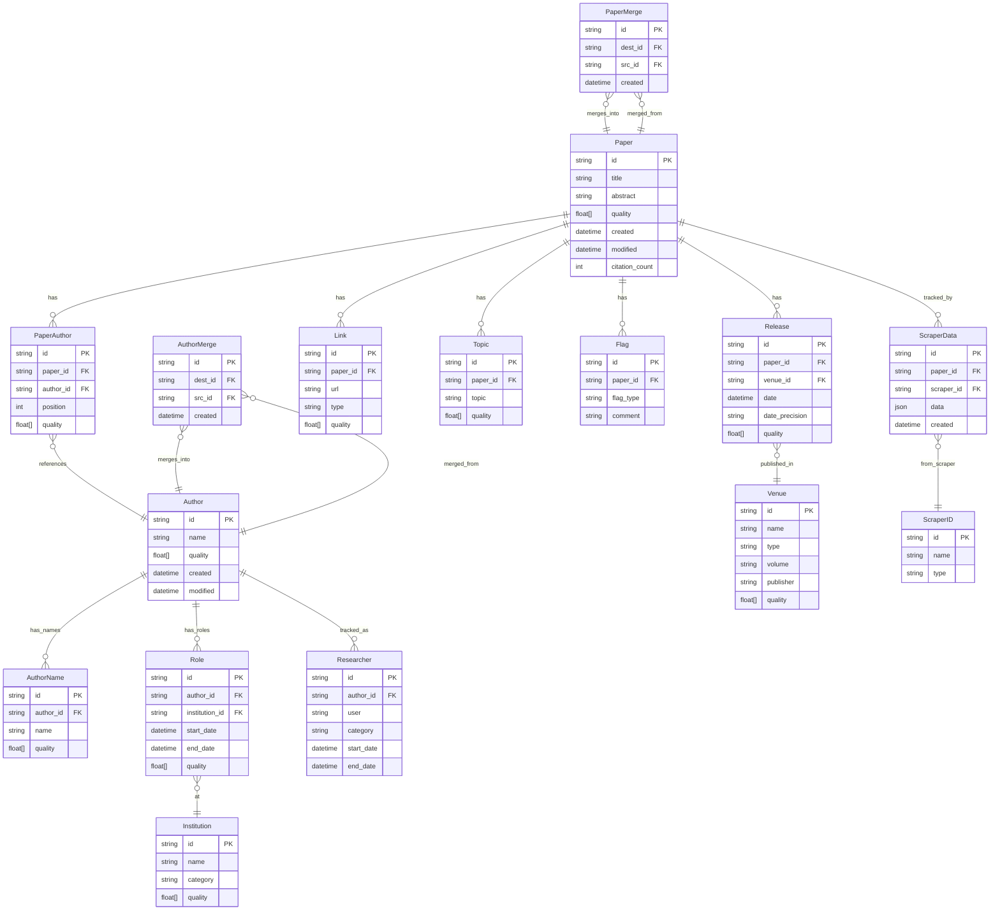
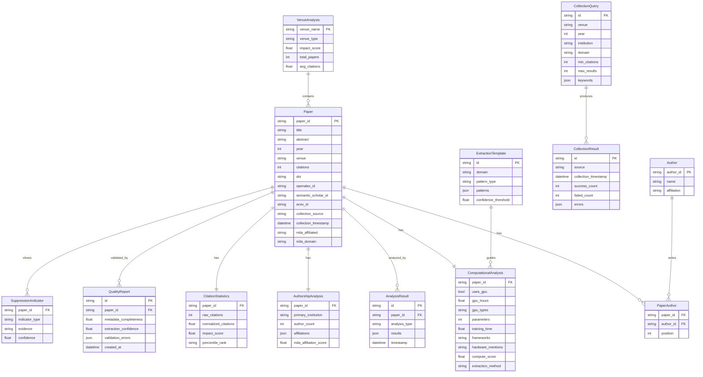
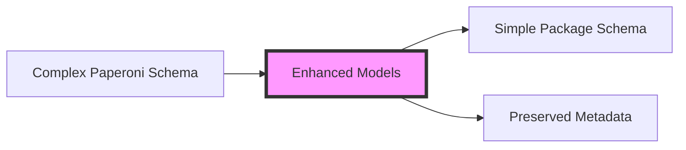

# Paperoni vs Package Database Schema Comparison

**Date**: 2025-01-06
**Purpose**: Visual comparison of data models between Paperoni and Compute Forecast Package

## Paperoni Database Schema

## Compute Forecast Package Schema

## Key Schema Differences

### 1. **Model Complexity**
- **Paperoni**: 15+ interconnected tables with deep relationships
- **Package**: 12 tables with flatter structure focused on analysis

### 2. **Quality Tracking**
- **Paperoni**: Every entity has `quality` float array built-in
- **Package**: Separate `QualityReport` table for validation

### 3. **Author/Institution Handling**
- **Paperoni**: Complex graph (Author → Role → Institution)
- **Package**: Simple string affiliation on Author

### 4. **Venue Representation**
- **Paperoni**: Full `Venue` entity with type, volume, publisher
- **Package**: Simple string field on Paper

### 5. **Temporal Tracking**
- **Paperoni**: `created`/`modified` timestamps on all entities
- **Package**: Timestamps only where analytically relevant

### 6. **Identity Management**
- **Paperoni**: Single UUID system with merge tracking
- **Package**: Multiple external IDs (OpenAlex, S2, ArXiv)

### 7. **Data Source Tracking**
- **Paperoni**: `ScraperData` + `ScraperID` for full provenance
- **Package**: Simple `collection_source` string

### 8. **Analysis Integration**
- **Paperoni**: No analysis tables (separate system)
- **Package**: Built-in analysis tables (Computational, Authorship, etc.)

## Why Enhanced Models Bridge the Gap

The enhanced models (ScrapedPaper, ScrapedAuthor, VenueMetadata) act as an adapter layer:

They preserve the rich data from Paperoni's schema while providing clean conversion methods to fit the Package's analysis-focused structure.
